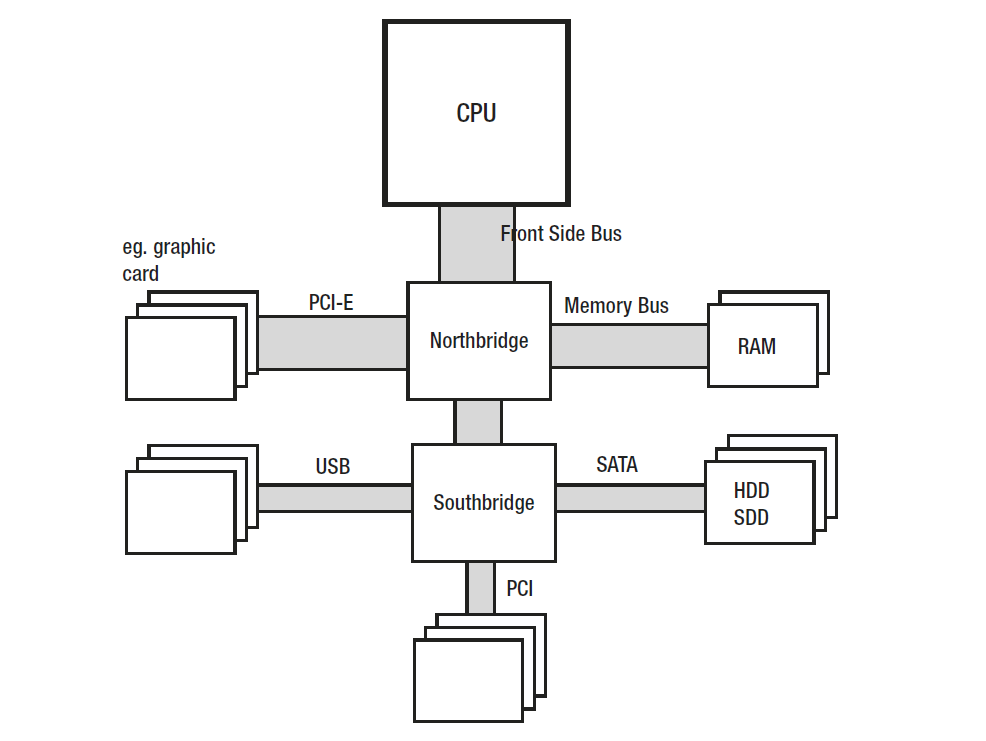

# Hardware

## main components

* Processor (CPU, central processing unit) - main unit, responsible for
executing instructions.
* Front Side Bus (FSB) - data bus that connects CPU with Northbridge.
* Northbridge - unit that contains mainly memory controller, responsible
for controlling communication between memory and CPU.
* RAM (Random Access Memory) - main computer memory. It stores
data and programs code as long as the power is on - hence it is also
referred to as Dynamic RAM (DRAM) or volatile memory.
* Memory Bus - data bus that connects RAM with Northbridge.
* Southbridge - chip that handles all of a computer’s I/O functions,
such as USB, audio, serial, the system BIOS, the ISA bus, the interrupt
controller, and the IDE channels -mass storage controllers such as
PATA and/or SATA.
* Storage I/O - non-volatile memory that stores data, including popular
HDD or SDD disks.

The main problem behind any memory management is a discrepancy between
performance of today’s CPU with respect to the memory and mass storage subsystems.
The processor is much faster than memory so every access to the memory introduces
unwanted delays. When the CPU needs to wait for a data access to memory (either read
or write), we call it a stall. The more stalls occur, the worse for the CPU utilization as its
power is just being wasted for waiting.

The typical current processor operates at a frequency of 3 GHz or above. Meanwhile,
the memory works with an internal clock with frequencies of only 200–400 MHz. This
makes the order of magnitude performance difference. It would be too expensive to
build RAM chips working with a frequency of CPU. This is because of how modern RAMs
are built - loading and unloading of internal capacitors takes time, which is very difficult
to reduce.
You may be surprised to find that memory works with such low frequencies. In fact,
in the computer stores we buy memory modules marked as having a popular clocking
like 1600 or 2400 MHz, which are far closer to the CPU speed. Where do such numbers
come from? As we will see, such specifications are only part of the more complex truth.
Memory module consist of internal memory cells (storing data) and additional
buffers that help to overcome their low internal clock frequency limitations. Some
additional tricks are use. Most of them rely on multiplying the read of
data:
* Sending data from the internal memory cell twice within a single
clock cycle. To be accurate, it is both on the falling as well as the
rising slope of the signal. Hence the name by far is the most popular
memory of various generations - Double Data Rate (DDR). This
technique is also referred to as double-pumping.
* Using internal buffering to make a few reads at once in one memory
clock cycle. This allows you to multiply the amount of data provided
seen outside compared to the amount that comes from the internal
frequency. DDR2 memory interface doubles the external clock
frequency while DDR3 and DDR4 quadruple it.
Let’s look at the typical DDR4 memory chip like 16 GB 2400 MHz (described in
specifications as DDR4-2400, PC4-19200). In such case the internal DRAM array clock
works at 300 MHz. The memory bus clock is quadrupled to 1200 MHz thanks to the
internal I/O buffer. Additionally, as with each clock cycle there are two transfers (both
slopes of the clock signal), and it results in a 2400 MT/s data rate (mega transfers per
seconds). This is where the 2400 MHz specification comes from.
The second signature - PC4-19200 - comes the maximum theoretical performance of such memory - it is 2400 MT/s
multiplied by 8 bytes (a single word 64-bit long is being transferred) gives the result of
19200 MB/s.

