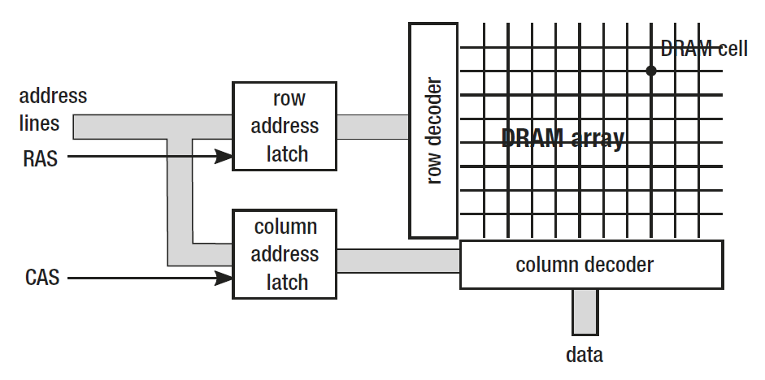

# Memory

There are currently two main types of memory found on personal computers, and
they differ significantly both in terms of production and usage cost and performance:
* Static Random Access Memory (SRAM) - they provide very fast access
but are quite complex, consisting of 4–6 transistors per cell (storing
single bit). They hold data as long as power is on, and no refresh is
needed. Because of high speed, they are used mainly in CPU caches.
* Dynamic Random Access Memory (DRAM) - very simple cell
construction (much smaller than SRAM) consists of a single
transistor and capacitor. Because of capacitor “leakage,” a cell
requires a constant refresh (which takes precious milliseconds and
stales memory reads). A signal read from the capacitor has to be
amplified also, which complicates things more. Reads and writes
also take time and are not linear because of capacitor delays (there is
some time required to wait to get a proper read or successful write)

Let’s devote a few more words to DRAM technology because it is the basis of
commonly used memory installed in our computers DIMM slots. As mentioned, a
single DRAM cell consists of a transistor and a capacitor and stores a single bit of data.
Such cells are grouped into DRAM arrays. The address to access a specific cell is being
provided via so-called address lines.
It would be very complicated and costly to have each cell in the DRAM array have
its own address. For example, in case of 32-bit addressing there would be 32-bit wide
address lines decoder (component responsible for specific cell selection). The number
of address lines influence overall cost of the system to a great extent - the more lines, the
more pins and interconnections between the memory controller and memory (RAM)
chips (modules). It would be too expensive and complicated, of course, even more so in
the case of computers with 64-bit word. Because of that address lines are being reused as
row and column lines and providing a full address is being split into two
phases.

Within a single array, the address (row) line selects the row and the column (data)
line selects the column. A single bit from a particular cell is being read in the following
process:
1. The number of the row is put on the address lines.
2. Interpretation is triggered by the Row Address Strobe (RAS) signal
on a dedicated line.
3. The number of the column is put on the address lines.
4. Interpretation is triggered by the Column Address Strobe (CAS)
signal.
5. Retrieve data - single bit (particular DRAM cell has been
addressed).

The transition times between individual steps of obtaining this single bit strongly
affects memory performance. These times can be familiar to you because they are an
important factor in the specification of memory modules, which greatly affect their price
by the way. So you are probably aware of DIMM modules timings like DDR3 9-9-9-24

All those timings are specified in clock cycles required to perform specific
action. Subsequently they have the following meanings:
* tCL (CAS latency) - the time between a column address strobe (CAS)
and beginning of the reply (receiving data).
* tRCD (RAS to CAS delay) - the minimal time between the row address
strobe (RAS) and column address strobe (CAS) may occur.
* tRP (Row Precharge) - the time it takes to precharge a row before
accessing it. The row cannot be used without prior preparation,
which is calling precharging.
* tRAS (Row active delay) - minimum time the row has to be active to
access information in it. This is typically at least the sum of the three
above times.
However, we are interested in the impact of DRAM memory architecture and its
timings on memory management. As you can see, the biggest is the cost of the row
change - RAS signal timings and precharging. This is one of the many reasons why
sequential memory access patterns are much faster than non-sequential ones. Reading
data in a burst from a single row (changing column occasionally) is much faster than
a need to change a row frequently. If the access pattern is completely random, most
probably we will be hit by those row-changing timings on each and every memory
access.
