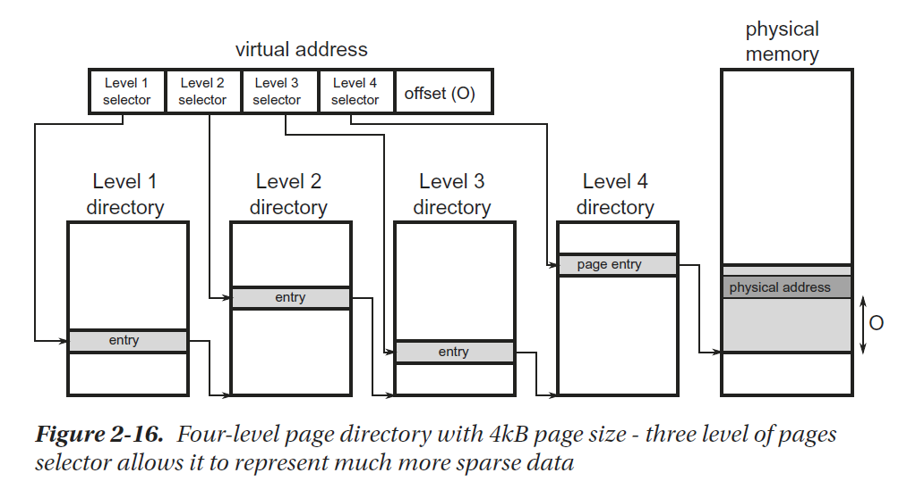
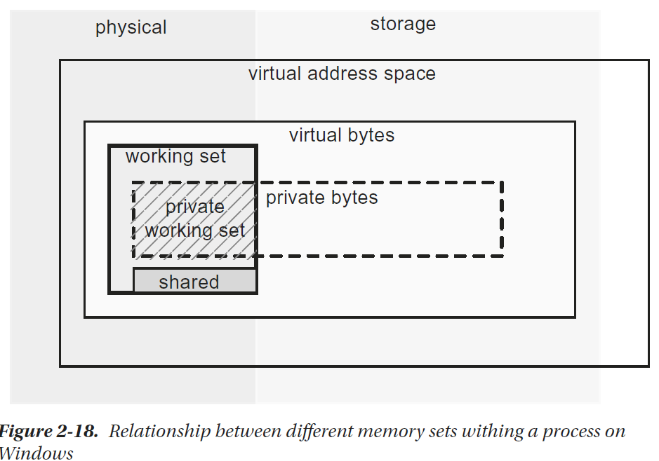
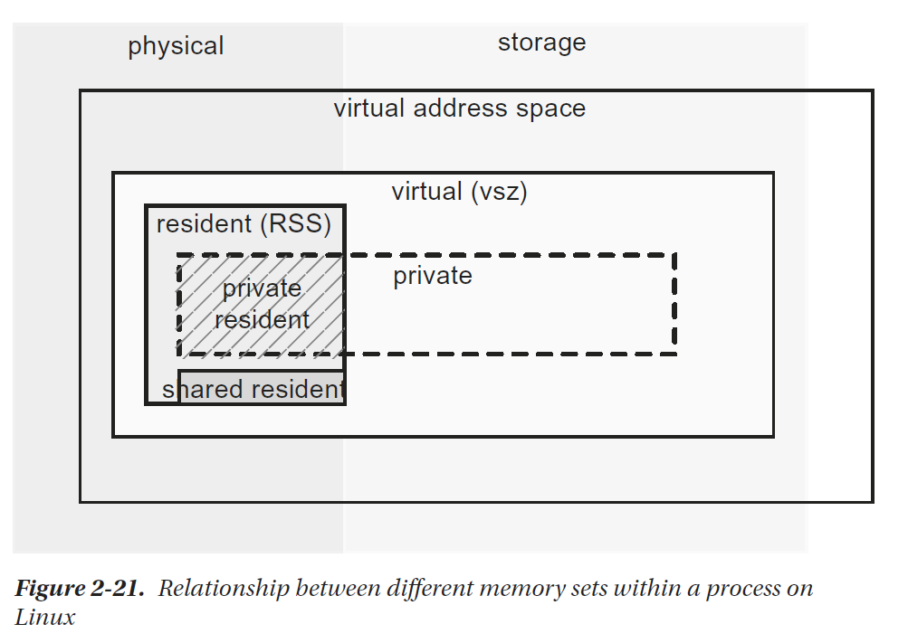

# Operation Systems

## Virtual Memory

Thus a very convenient abstraction has been introduced - a virtual memory. It moves
memory management logic to the operating system, which provides a program a so-called
virtual address space. In particular it means that each process thinks it is the only
one running in the system and that the whole memory is for its own purposes. Even
more. Because address space is virtual, it can be larger than the physical memory. This
allows it to extend physical DRAM memory with secondary storage like mass storage
hard drives.

Here is where the operating system memory manager comes to play. It has two main
responsibilities:
* Mapping virtual address space to physical memory - there is 32-bit-long
virtual address on 32-bit machines and 64-bit long on 64-bit
machines (although currently only lower 48 bits are used, which
still allows an address of 128 TB of data; and both simplify the
architecture and allows us to avoid unnecessary overhead).
* Moving some memory regions from DRAM memory to hard drives and
back as they are requested or currently not needed. Obviously as the
total used memory may be bigger than physical memory, sometimes
some parts of it must be temporarily stored to slower media like
HDD. A place where such data is stored is called page file or swap file.

Virtual memory is implemented in CPU (with the help of Memory Management
Unit - MMU) and used with cooperation with OS. Virtual memory management is
organized in so-called pages. As it would be impractical to map virtual to physical space
byte by byte, instead whole pages (continuous blocks of memory) are mapped. A page
is therefore the basic building block for managing memory from the operating system
point of view.
There is also a page directory maintained by OS per each process that allows us to
map a virtual address to a physical one. Simply put, page directory entries point to a
page’s physical starting addresses and other metadata like privileges. In old times there
was a simple, one-level mapping where an address consisted of a page selector and offset
within a page
one-level page directory has the main drawback of producing too big pages or too
big of page directory size. A big page is a major problem because it would be a waste of
resources – an operating system requires page alignment when allocating memory. So
even for small data it would need to allocate a whole big page. On the other hand, too
big of a page directory is also a problem as it is being stored in the main memory per
each process so it would be a waste of memory.
owadays a commonly used approach is to introduce multiple levels of indexes.
This allows us to compact the storage of a sparse page directory data while maintaining
a small page size. Currently on most architectures, a typical page size is 4 kB (including
x86, x64 and ARM) and 4-level page directory

When a virtual address is being translated into a physical address, it requires a page
directory walk:
* Level 1 selector selects an entry within level 1 directory, which points
to one of the level 2 directory entries.
* Level 2 selector selects an entry within specific level 2 directory entry,
which points to one of the level 3 directory entries.
* Level 3 selector selects an entry within specific level 3 directory entry,
which points to one of the level 4 directory entries.
* Eventually level 4 selector selects an entry within specific level 4
directory entry, which points directly to some page in the physical
memory.
* Offset points to specific address within selected page.

Such translation requires traversing a tree but as we said, a page directory is kept
in the main memory as all other data. This means it could be also cached through L1/
L2/L3 caches. But still, it introduced an enormous overhead if each and every address
translation (operation performed very often) would require access to those data (even
using L1 cache). Thus, Translation Look-Aside Buffers (TLB) has been introduced, which
cache the translation itself. The idea is simple - TLB works as a map where the selector is
a key and the page’s physical address start is a value. TLBs are built to be extremely fast
so they are small in terms of storage. They are also multilevel as was the case with page
directory structure. The result of the TLB miss (no virtual-to-physical translation already
cached) is performing a full-page directory walk, which is costly as we mentioned.

```
**Interesting note** Typically, L1 operates on the virtual addresses because the
cost of translation to the physical address would be much bigger than the fast
cache access itself. This means when a page is being changed, all or some cache
lines have to be invalidated. Thus, often page changes negatively impact cache
performance also.
```

## Large Pages

As it can be seen from previous descriptions, a virtual address translation can be costly
and it would be great to avoid it as often as possible. The main approach would be to use
a big page size. This would require less address translations as many addresses would fit
into the same page, with already a TLB-cached translation. But as we stated, big pages
are a waste of resources. There is one solution - so-called large (or huge) pages. With
hardware support they allow us to create a large, continuous physical memory block
consisting of many sequentially laid-off normal pages. These pages are typically two/
three orders of magnitude bigger than a normal page. They can be useful in scenarios
when a program requires random access throughout gigabytes of data. Database engines
are examples of large pages consumers.


## General Memory Layout

Knowing the basic memory builder block, we can now go on to discuss memory at a
higher level. The first question that arises is how a program looks in the memory.
the virtual address space is divided into two areas:
* Kernel space - the upper range of addresses is occupied by the
operating system itself. It is known as the kernel space, since it is the
kernel that owns this area and only the kernel is allowed to operate
on it.
* User space - the lower part of the address range is assigned to the
process. This area is referred to as user space because it is the user
process that has access to that area.
Regarding address space, when presenting schematic diagrams of a memory layout,
the most common is a convention in which low addresses (starting at 0) are at the
bottom and then are rising upward.
Here are the remaining memory segments description from Figure 2-17:
* The data segment includes both initialized and uninitialized global
and static variables.
* The text segment containing the application binaries along with
string literals. It is named as such for historical reasons because it
contained, by definition, only read-only data.

## Windows Memory Management

The memory management subsystem in Windows is exposed by two main layers:
* Virtual API - this is a low-level API that is operating on the
page-granularity. You may have heard of the VirtualAlloc and
VirtualFree functions that are examples of functions that belong to
this layer.
* Heap API - higher-level API providing Allocator (recall it from
Chapter 1) for allocations smaller than page size. This layer includes,
among others, HeapAlloc and HeapFree functions.
Heap API (exposing Heap Manager) is being typically consumed by the C/C++
runtime implementation of memory management. You are probably familiar with
the popular operators new and delete or malloc and free from C/C++. As CLR has its
own Allocator implementation for creating .NET objects 6), mostly Virtual API is being used by it. In a nutshell, the CLR asks the
operating system for additional pages, and the appropriate allocation of objects within
these pages is handled by itself. Heap API is also used by the CLR to create many smaller,
internal data structures.

On Windows, it is important to understand the different memory categories
associated with the process. It’s not as trivial as it might seem. At the same time, without
this knowledge it will be hard for us to understand one of the most important issues -
how much memory the process we observe actually consumes?
In order to answer this question, we need additional knowledge about managing
pages in Windows. Page can be in the four different states listed below:
* Free - not assigned yet to any process nor system itself.
* Committed (private) - assigned to a process. They are also called
private pages because they can be used only by this particular
process. When a committed page is being accessed for the first time
by the process, it is being zero-initialized. Committed pages can be
paged to disk and back.
* Reserved - reserved to a process. Memory reservation means
obtaining a continuous range of virtual addresses without actually
allocating memory. This allows us to reserve some space in advance,
and only then actually commit some parts of it as they are needed.
This does not consume memory physically and is only lightweight
preparation of some internal data structures. Programs can also
reserve and commit memory at once, when they know how big a
block of memory they need at the moment.
* Shareable - reserved for a process but may be shared with other
processes. This typically means binary images and memory-mapped
files of system-wide libraries (DLLs) and resources (fonts, translations).

Moreover, private pages can be locked, which makes them remaining in physical
memory (will not be moved to the page file) until explicitly unlocked or when the
application ends. Locking can be beneficial for a performance-critical path in the
program.

Armed with the knowledge of the page statuses, we can look at into what categories
a Windows process memory is divided

* Working set - this is a part of virtual address space that currently
resides in the physical memory. This means it can be further divided
into:
* Private working set - consists of committed (private) pages in the
physical memory.
* Shareable working set - consists of all shareable pages (no matter
if they are actually shared or not).
* Shared working set - consists of shareable pages that are actually
shared with other processes.
* Private bytes - all committed (private) pages - both in the physical
and paged memory.
* Virtual bytes - both committed (private) and reserved memory.
* Paged bytes - part of the virtual bytes that are stored in the page file.



It is assumed that the most important indicator
is the private working set because it shows what is the actual impact of our process on
the consumption of the most important physical RAM.
Due to its internal structures, when Windows reserves a memory region for a
process, it takes into account the following restriction - both the region start and its
size has to be a multiple of the system page size (usually 4kB) and so-called allocation
granularity (usually 64kB). This in fact means that each reserved region starts with an
address being a multiplication of 64kB and has size being a multiplication of 64kB. If
we want to allocate less, the reminder will be inaccessible (unusable). Thus proper
alignment and size of the blocks are crucial in not wasting memory.

## Windows Memory Layout

Now let’s look deeper into the processes running on Windows and executing .NET
application. A process contains one default process heap (mostly used by internal
Windows functions) and any number of optional heaps (created via Heap API).

There are three main heap types:
* normal (NT) heap - used by normal (non-Universal Windows
Platform - UWP) apps. It provides basic functionality of managing
memory blocks.
* low-fragmentation heap - an additional layer above normal heap
functionality that manages allocations in varied-sized predefined
blocks. This prevents fragmentation for small data and additionally,
due to the internal OS optimizations makes this access slightly faster.
* segment heap - used by Universal Windows Platform apps, which
provides more sophisticated allocators (including low-fragmentation
allocator similar to mentioned above).

## Linux Memory Management

Like Windows, the basic builder block in Linux is the page, and it is also typically
4kB. The page can be in three different states listed below:
* free - not assigned yet to any process nor system itself.
* allocated - assigned to a process.
* shared - reserved for a process but may be shared with other
processes. This typically means binary images and memory-mapped
files of system-wide libraries and resources.

Process memory utilization can be measured with
respect to the following terms:
* virtual (marked by some tools as vsz) - total size of the virtual
address space reserved so far by the process. In popular “top” tool it
is a VIRT column.
* resident (Resident Set Size, RSS) - space of pages that resides
currently in the physical memory. Some resident pages can be
shared among processes (those which are file backed or anonymous
also). Therefore, this corresponds to “working set” measurement on
Windows platform. In “top” tool this is referred to as a RES column.
Further it can be split into:
* private resident pages - those are all anonymous resident pages
reserved for this process (indicated by MM_ANONPAGES kernel
counter). That somehow correspond to the “private working set”
measurement from Windows.
* shared resident pages - those are both file backed (indicated by
MM_FILEPAGES kernel counter) and anonymous resident pages of
the process. Corresponding to “shared working set.” In “top” this
is referred to as SHR memory.
* private - all private pages of the process. In the “top” tool this is a
DATA column. Please note this is an indicator of reserved memory and
does not say how much of it has been already accessed (“touched”)
and thus has become resident. Corresponds to “private bytes” on
Windows.
* swapped - part of the virtual memory that has been stored in the swap
file.


## Linux Memory Layout

Similar to Windows, the system provides an API for operating on memory pages. It
contains:
* mmap - to directly manipulate pages (including file maps, shared and
normal ones, and anonymous mapping that is not related to any file
but being used to store program data).
* brk/sbrk - this is the closest equivalent of the VirtualAlloc method.
It allows us to set/increase so-called “program break,” which in fact
means increasing the heap size.

